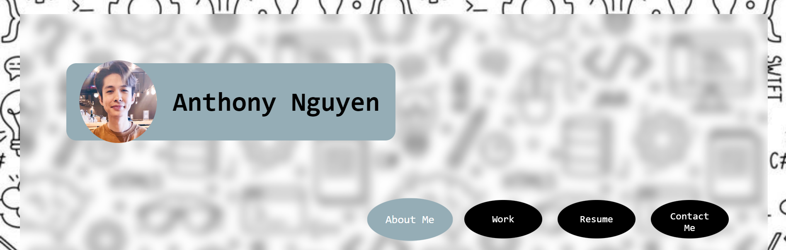
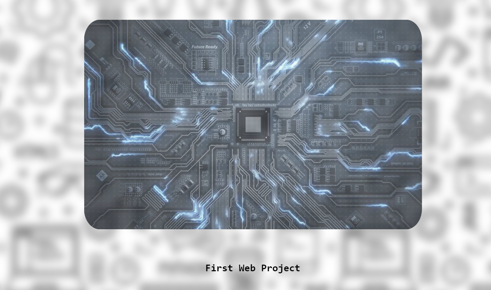

# My-Portfolio

## Technology Used

| Technology Used         | Resource URL           | 
| ------------- |:-------------:| 
| HTML    | [https://developer.mozilla.org/en-US/docs/Web/HTML](https://developer.mozilla.org/en-US/docs/Web/HTML) | 
| CSS     | [https://developer.mozilla.org/en-US/docs/Web/CSS](https://developer.mozilla.org/en-US/docs/Web/CSS)      |   
| Git | [https://git-scm.com/](https://git-scm.com/)     | 

## Description

Creating my webpage portfolio with HTML and CSS!

Deployed Site []()

## Webpage Sample Code

#### HTML

```html
    <header>
        <a href="https://github.com/Blackswan1010" style="text-decoration: none;">
        <h1>Anthony Nguyen</h1></a>
    </header>

    <nav>
        <a href="#aboutme"><button>About Me</button></a>
        <a href="#work"><button>Work</button></a>
        <a href="#resume"><button>Resume</button></a>
        <a href="#contact"><button>Contact Me</button></a>
    </nav>
```

In this html code is the base structure of the portfolio header, with the header containing a recent photo of the developer and developer's name, and the navigation bar for the portfolio.

#### CSS
```css
    :root {
    --dustyblue: rgb(149, 173, 182);
    --radius: 1.5rem;
    --font-family: monospace;
    --black: black;
    --white: white;
}

nav button:hover {
    background-color: var(--dustyblue);
    transform: scale(1.1);
}

nav button::after {
    content: '';
    background-image: radial-gradient(circle farthest-corner at 10% 20%, rgba(167, 206, 203, 1) 17.8%,
            rgba(203, 179, 191, 1) 100.2%);
    filter: blur(15px);
    position: absolute;
    left: 0;
    top: 0;
}

nav button:active {
    transform: scale(0.9) rotate(3deg);
    background-image: radial-gradient(circle farthest-corner at 10% 20%, rgba(167, 206, 203, 1) 17.8%,
            rgba(203, 179, 191, 1) 100.2%);
    border: 5px solid var(--white);
    transition: 0.5s;
}

```
The css code above makes the navigation bar responsive to the user when the cursor is hovering and focusing over the button, and when the button has been clicked.


## My Webpage Image Usage Sample

A respsonsive navigation bar with the "zoom"(transform property) effect and color change when cursoring is hovering.
<br/>
<br/>


<br/>

A responsive image linked with the developer's first web application/project with the blur and "zoom"(transform property) effect when cursor is hovering.
<br/>
<br/>


<br/>

## Learning Points

-using css variables to reuse the value in multiple class/element selectors
<br/>
-using a wireframe for visual reference
<br/>
-how to make a respsonsive layout with media queries and flexbox placements
<br/>
-using reset.css to format any unwanted native browser properties to default or 0
<br/>
-using pseudo classes/elements to make a responsive page

## Author Info

#### Anthony Nguyen
```md
* [Github](https://github.com/Blackswan1010)
```

## Credits

Everyone in bootcamp class

## License

N/A